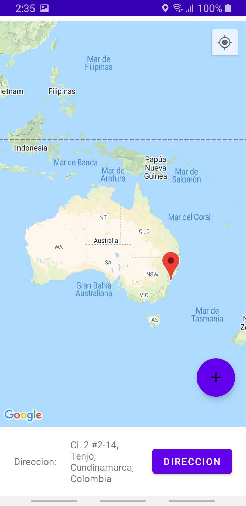

# Mapas en android

### Presentado por:

Jeisson G. Sanchez Ramos.

### Enunciado del laboratorio

[ver](https://github.com/ieti-eci/3.4-android-geolocation-api)

### Ubicacion actual

### Ubicacion actual texto

### Añadir ubicacion

